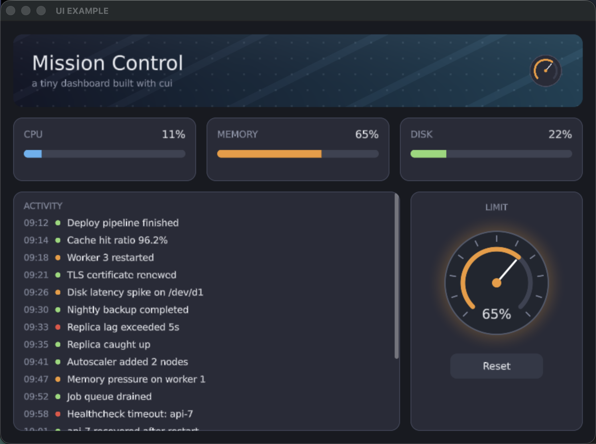

# Mission Control — a cui example

A mini dashboard written in [C3](https://c3-lang.org) that showcases the
[cui library](https://github.com/tonis2/cui).



## Run

```sh
c3c run ui
```

Should run out of box currently on Mac silicon and linux builds, will add windows too soon.
